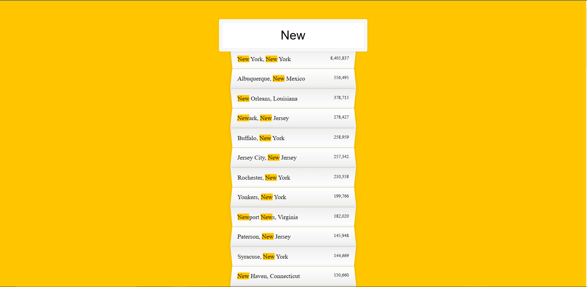

# ABOUT FETCH DATA AND REGEX

How to fetch data from an URL and perform some searching operation using regex.

Ex => when we search something on search box and it shows some sort of search recomendation.

## BACKGROUND SCREENSHOT

